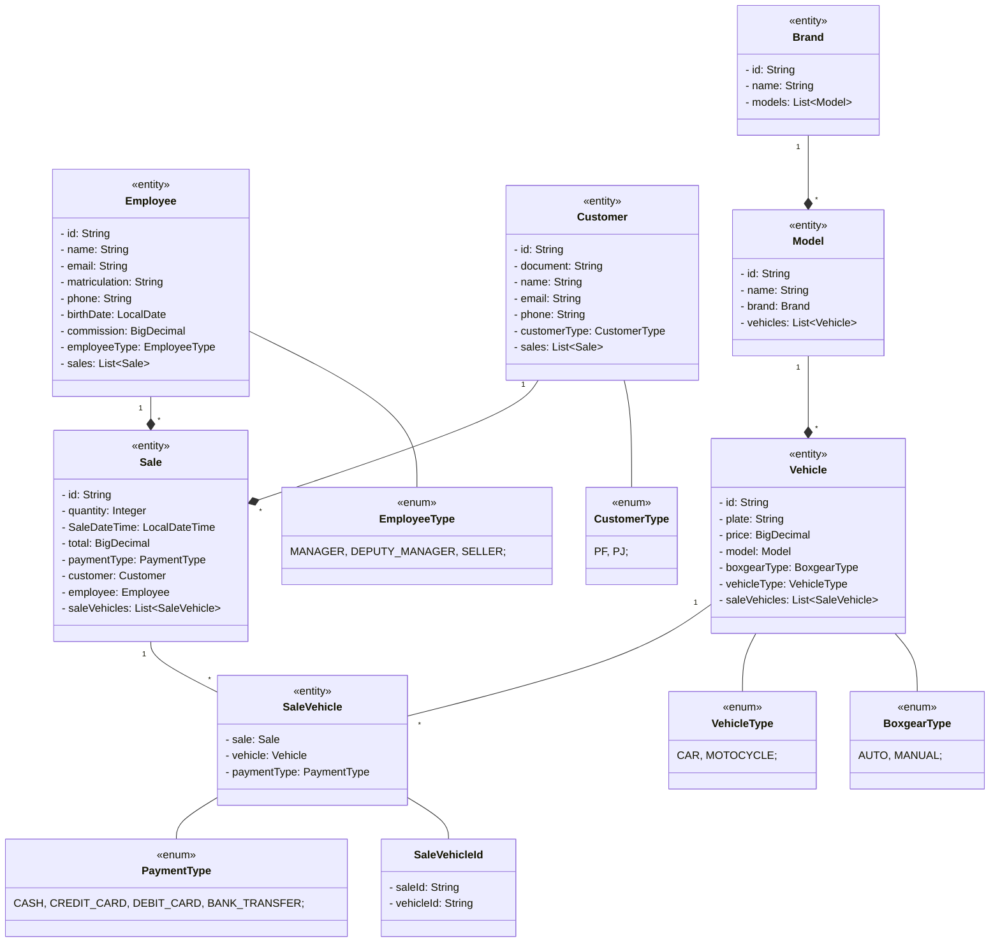

# Automendes

[](https://github.com/abnerjosefelixbarbosa/automendes/actions/workflows/build-backend.yml)

## About

Automendes backend application.

# Models

## Class Diagram



# Project Resources

## Features

- Register Brand
- Update Brand by Id
- List Brands
- Register Model
- Update Model By Id
- List Models
- Register Vehicle
- Update Vehicle By Id
- List Vehicles
- Register Employee
- Update Employee By Id
- List Employees
- Register Customer
- Update Customer By Id
- Search Customer By Document

## Backend

- Java
- Spring Boot
- Hibernate/JPA
- Lombok
- PostgreeSQL
- H2
- MVC
- SOLID
- API Rest

# API Document

```json
{
  "openapi": "3.0.1",
  "info": {
    "title": "API automendes.",
    "description": "Documentação da API automendes com a OpenAPI",
    "version": "1.0.0"
  },
  "servers": [
    {
      "url": "http://localhost:8080",
      "description": "Generated server url"
    }
  ],
  "paths": {
    "/vehicles/update-vehicle-by-id": {
      "put": {
        "tags": [
          "vehicle-controller"
        ],
        "summary": "Atualizar veículo pelo id.",
        "description": "Atualiza um veículo pelo id.",
        "operationId": "updateVehicleById",
        "parameters": [
          {
            "name": "id",
            "in": "query",
            "required": true,
            "schema": {
              "type": "string"
            }
          }
        ],
        "requestBody": {
          "content": {
            "application/json": {
              "schema": {
                "$ref": "#/components/schemas/VehicleRequestDTO"
              }
            }
          },
          "required": true
        },
        "responses": {
          "404": {
            "description": "Retorna um erro de recurso não encontrado.",
            "content": {
              "*/*": {
                "schema": {
                  "$ref": "#/components/schemas/ExceptionDTO"
                }
              }
            }
          },
          "400": {
            "description": "Retorna um erro de requisição.",
            "content": {
              "*/*": {
                "schema": {
                  "oneOf": [
                    {
                      "$ref": "#/components/schemas/ExceptionDTO"
                    },
                    {
                      "type": "object",
                      "additionalProperties": {
                        "type": "string"
                      }
                    }
                  ]
                }
              }
            }
          },
          "200": {
            "description": "Atualiza um veículo.",
            "content": {
              "*/*": {
                "schema": {
                  "$ref": "#/components/schemas/VehicleResponseDTO"
                }
              }
            }
          }
        }
      }
    },
    "/models/update-model-by-id": {
      "put": {
        "tags": [
          "model-controller"
        ],
        "summary": "Atualizar modelo pelo id.",
        "description": "Atualiza um modelo pelo id.",
        "operationId": "updateModelById",
        "parameters": [
          {
            "name": "id",
            "in": "query",
            "required": true,
            "schema": {
              "type": "string"
            }
          }
        ],
        "requestBody": {
          "content": {
            "application/json": {
              "schema": {
                "$ref": "#/components/schemas/ModelRequestDTO"
              }
            }
          },
          "required": true
        },
        "responses": {
          "404": {
            "description": "Retorna um erro de recurso não encontrado.",
            "content": {
              "*/*": {
                "schema": {
                  "$ref": "#/components/schemas/ExceptionDTO"
                }
              }
            }
          },
          "400": {
            "description": "Retorna um erro de requisição.",
            "content": {
              "*/*": {
                "schema": {
                  "oneOf": [
                    {
                      "$ref": "#/components/schemas/ExceptionDTO"
                    },
                    {
                      "type": "object",
                      "additionalProperties": {
                        "type": "string"
                      }
                    }
                  ]
                }
              }
            }
          },
          "200": {
            "description": "Atualiza um modelo.",
            "content": {
              "*/*": {
                "schema": {
                  "$ref": "#/components/schemas/ModelResposeDTO"
                }
              }
            }
          }
        }
      }
    },
    "/employees/update-employee-by-id": {
      "put": {
        "tags": [
          "employee-controller"
        ],
        "summary": "Atualizar funcionário pelo id.",
        "description": "Registra um funcionário pelo id.",
        "operationId": "updateEmployeeById",
        "parameters": [
          {
            "name": "id",
            "in": "query",
            "required": true,
            "schema": {
              "type": "string"
            }
          }
        ],
        "requestBody": {
          "content": {
            "application/json": {
              "schema": {
                "$ref": "#/components/schemas/EmployeeRequestDTO"
              }
            }
          },
          "required": true
        },
        "responses": {
          "404": {
            "description": "Retorna um erro de recurso não encontrado.",
            "content": {
              "*/*": {
                "schema": {
                  "$ref": "#/components/schemas/ExceptionDTO"
                }
              }
            }
          },
          "400": {
            "description": "Retorna um erro de requisição.",
            "content": {
              "*/*": {
                "schema": {
                  "oneOf": [
                    {
                      "$ref": "#/components/schemas/ExceptionDTO"
                    },
                    {
                      "type": "object",
                      "additionalProperties": {
                        "type": "string"
                      }
                    }
                  ]
                }
              }
            }
          },
          "200": {
            "description": "Atualiza um funcionário.",
            "content": {
              "*/*": {
                "schema": {
                  "$ref": "#/components/schemas/EmployeeResponseDTO"
                }
              }
            }
          }
        }
      }
    },
    "/customers/update-customer-by-id": {
      "put": {
        "tags": [
          "customer-controller"
        ],
        "summary": "Atualizar cliente pelo id.",
        "description": "Atualiza um cliente pelo id.",
        "operationId": "updateCustomerById",
        "parameters": [
          {
            "name": "id",
            "in": "query",
            "required": true,
            "schema": {
              "type": "string"
            }
          }
        ],
        "requestBody": {
          "content": {
            "application/json": {
              "schema": {
                "$ref": "#/components/schemas/CustomerRequestDTO"
              }
            }
          },
          "required": true
        },
        "responses": {
          "404": {
            "description": "Retorna um erro de recurso não encontrado.",
            "content": {
              "*/*": {
                "schema": {
                  "$ref": "#/components/schemas/ExceptionDTO"
                }
              }
            }
          },
          "400": {
            "description": "Retorna um erro de requisição.",
            "content": {
              "*/*": {
                "schema": {
                  "oneOf": [
                    {
                      "$ref": "#/components/schemas/ExceptionDTO"
                    },
                    {
                      "type": "object",
                      "additionalProperties": {
                        "type": "string"
                      }
                    }
                  ]
                }
              }
            }
          },
          "200": {
            "description": "Atualiza um cliente.",
            "content": {
              "*/*": {
                "schema": {
                  "$ref": "#/components/schemas/CustomerResponseDTO"
                }
              }
            }
          }
        }
      }
    },
    "/brands/update-brand-by-id": {
      "put": {
        "tags": [
          "brand-controller"
        ],
        "summary": "Atualizar marca pelo id.",
        "description": "Atualiza uma marca pelo id.",
        "operationId": "updateBrandById",
        "parameters": [
          {
            "name": "id",
            "in": "query",
            "required": true,
            "schema": {
              "type": "string"
            }
          }
        ],
        "requestBody": {
          "content": {
            "application/json": {
              "schema": {
                "$ref": "#/components/schemas/BrandRequestDTO"
              }
            }
          },
          "required": true
        },
        "responses": {
          "404": {
            "description": "Retorna um erro de recurso não encontrado.",
            "content": {
              "*/*": {
                "schema": {
                  "$ref": "#/components/schemas/ExceptionDTO"
                }
              }
            }
          },
          "400": {
            "description": "Retorna um erro de requisição.",
            "content": {
              "*/*": {
                "schema": {
                  "oneOf": [
                    {
                      "$ref": "#/components/schemas/ExceptionDTO"
                    },
                    {
                      "type": "object",
                      "additionalProperties": {
                        "type": "string"
                      }
                    }
                  ]
                }
              }
            }
          },
          "200": {
            "description": "Altera uma marca.",
            "content": {
              "*/*": {
                "schema": {
                  "$ref": "#/components/schemas/BrandResponseDTO"
                }
              }
            }
          }
        }
      }
    },
    "/vehicles/register-vehicle": {
      "post": {
        "tags": [
          "vehicle-controller"
        ],
        "summary": "Registrar veículo.",
        "description": "Registra um veículo.",
        "operationId": "registerVehicle",
        "requestBody": {
          "content": {
            "application/json": {
              "schema": {
                "$ref": "#/components/schemas/VehicleRequestDTO"
              }
            }
          },
          "required": true
        },
        "responses": {
          "404": {
            "description": "Retorna um erro de recurso não encontrado.",
            "content": {
              "*/*": {
                "schema": {
                  "$ref": "#/components/schemas/ExceptionDTO"
                }
              }
            }
          },
          "400": {
            "description": "Retorna um erro de requisição.",
            "content": {
              "*/*": {
                "schema": {
                  "oneOf": [
                    {
                      "$ref": "#/components/schemas/ExceptionDTO"
                    },
                    {
                      "type": "object",
                      "additionalProperties": {
                        "type": "string"
                      }
                    }
                  ]
                }
              }
            }
          },
          "201": {
            "description": "Registra um veículo.",
            "content": {
              "*/*": {
                "schema": {
                  "$ref": "#/components/schemas/VehicleResponseDTO"
                }
              }
            }
          }
        }
      }
    },
    "/models/register-model": {
      "post": {
        "tags": [
          "model-controller"
        ],
        "summary": "Registrar modelo.",
        "description": "Registra um modelo.",
        "operationId": "registerModel",
        "requestBody": {
          "content": {
            "application/json": {
              "schema": {
                "$ref": "#/components/schemas/ModelRequestDTO"
              }
            }
          },
          "required": true
        },
        "responses": {
          "404": {
            "description": "Retorna um erro de recurso não encontrado.",
            "content": {
              "*/*": {
                "schema": {
                  "$ref": "#/components/schemas/ExceptionDTO"
                }
              }
            }
          },
          "400": {
            "description": "Retorna um erro de requisição.",
            "content": {
              "*/*": {
                "schema": {
                  "oneOf": [
                    {
                      "$ref": "#/components/schemas/ExceptionDTO"
                    },
                    {
                      "type": "object",
                      "additionalProperties": {
                        "type": "string"
                      }
                    }
                  ]
                }
              }
            }
          },
          "201": {
            "description": "Registra um modelo.",
            "content": {
              "*/*": {
                "schema": {
                  "$ref": "#/components/schemas/ModelResposeDTO"
                }
              }
            }
          }
        }
      }
    },
    "/employees/register-employee": {
      "post": {
        "tags": [
          "employee-controller"
        ],
        "summary": "Registrar funcionário.",
        "description": "Registra um funcionário.",
        "operationId": "registerEmployee",
        "requestBody": {
          "content": {
            "application/json": {
              "schema": {
                "$ref": "#/components/schemas/EmployeeRequestDTO"
              }
            }
          },
          "required": true
        },
        "responses": {
          "404": {
            "description": "Retorna um erro de recurso não encontrado.",
            "content": {
              "*/*": {
                "schema": {
                  "$ref": "#/components/schemas/ExceptionDTO"
                }
              }
            }
          },
          "400": {
            "description": "Retorna um erro de requisição.",
            "content": {
              "*/*": {
                "schema": {
                  "oneOf": [
                    {
                      "$ref": "#/components/schemas/ExceptionDTO"
                    },
                    {
                      "type": "object",
                      "additionalProperties": {
                        "type": "string"
                      }
                    }
                  ]
                }
              }
            }
          },
          "201": {
            "description": "Registra um funcionário.",
            "content": {
              "*/*": {
                "schema": {
                  "$ref": "#/components/schemas/EmployeeResponseDTO"
                }
              }
            }
          }
        }
      }
    },
    "/customers/register-customer": {
      "post": {
        "tags": [
          "customer-controller"
        ],
        "summary": "Registrar cliente.",
        "description": "Registra um cliente.",
        "operationId": "registerCustomer",
        "requestBody": {
          "content": {
            "application/json": {
              "schema": {
                "$ref": "#/components/schemas/CustomerRequestDTO"
              }
            }
          },
          "required": true
        },
        "responses": {
          "404": {
            "description": "Retorna um erro de recurso não encontrado.",
            "content": {
              "*/*": {
                "schema": {
                  "$ref": "#/components/schemas/ExceptionDTO"
                }
              }
            }
          },
          "400": {
            "description": "Retorna um erro de requisição.",
            "content": {
              "*/*": {
                "schema": {
                  "oneOf": [
                    {
                      "$ref": "#/components/schemas/ExceptionDTO"
                    },
                    {
                      "type": "object",
                      "additionalProperties": {
                        "type": "string"
                      }
                    }
                  ]
                }
              }
            }
          },
          "201": {
            "description": "Registra um cliente.",
            "content": {
              "*/*": {
                "schema": {
                  "$ref": "#/components/schemas/CustomerResponseDTO"
                }
              }
            }
          }
        }
      }
    },
    "/brands/register-brand": {
      "post": {
        "tags": [
          "brand-controller"
        ],
        "summary": "Registrar marca.",
        "description": "Registra uma marca.",
        "operationId": "registerBrand",
        "requestBody": {
          "content": {
            "application/json": {
              "schema": {
                "$ref": "#/components/schemas/BrandRequestDTO"
              }
            }
          },
          "required": true
        },
        "responses": {
          "404": {
            "description": "Retorna um erro de recurso não encontrado.",
            "content": {
              "*/*": {
                "schema": {
                  "$ref": "#/components/schemas/ExceptionDTO"
                }
              }
            }
          },
          "400": {
            "description": "Retorna um erro de requisição.",
            "content": {
              "*/*": {
                "schema": {
                  "oneOf": [
                    {
                      "$ref": "#/components/schemas/ExceptionDTO"
                    },
                    {
                      "type": "object",
                      "additionalProperties": {
                        "type": "string"
                      }
                    }
                  ]
                }
              }
            }
          },
          "201": {
            "description": "Registra uma marca.",
            "content": {
              "*/*": {
                "schema": {
                  "$ref": "#/components/schemas/BrandResponseDTO"
                }
              }
            }
          }
        }
      }
    },
    "/vehicles/list-vehicles": {
      "get": {
        "tags": [
          "vehicle-controller"
        ],
        "summary": "Listar Veículos.",
        "description": "Lista Veículos.",
        "operationId": "listVehicles",
        "parameters": [
          {
            "name": "pageable",
            "in": "query",
            "required": true,
            "schema": {
              "$ref": "#/components/schemas/Pageable"
            }
          }
        ],
        "responses": {
          "404": {
            "description": "Retorna um erro de recurso não encontrado.",
            "content": {
              "*/*": {
                "schema": {
                  "$ref": "#/components/schemas/ExceptionDTO"
                }
              }
            }
          },
          "400": {
            "description": "Retorna um erro de requisição.",
            "content": {
              "*/*": {
                "schema": {
                  "oneOf": [
                    {
                      "$ref": "#/components/schemas/ExceptionDTO"
                    },
                    {
                      "type": "object",
                      "additionalProperties": {
                        "type": "string"
                      }
                    }
                  ]
                }
              }
            }
          },
          "200": {
            "description": "Lista Veículos.",
            "content": {
              "*/*": {
                "schema": {
                  "type": "array",
                  "items": {
                    "$ref": "#/components/schemas/VehicleResponseDTO"
                  }
                }
              }
            }
          }
        }
      }
    },
    "/models/list-models": {
      "get": {
        "tags": [
          "model-controller"
        ],
        "summary": "Listar modelos.",
        "description": "Lista modelos.",
        "operationId": "listModels",
        "parameters": [
          {
            "name": "pageable",
            "in": "query",
            "required": true,
            "schema": {
              "$ref": "#/components/schemas/Pageable"
            }
          }
        ],
        "responses": {
          "404": {
            "description": "Retorna um erro de recurso não encontrado.",
            "content": {
              "*/*": {
                "schema": {
                  "$ref": "#/components/schemas/ExceptionDTO"
                }
              }
            }
          },
          "400": {
            "description": "Retorna um erro de requisição.",
            "content": {
              "*/*": {
                "schema": {
                  "oneOf": [
                    {
                      "$ref": "#/components/schemas/ExceptionDTO"
                    },
                    {
                      "type": "object",
                      "additionalProperties": {
                        "type": "string"
                      }
                    }
                  ]
                }
              }
            }
          },
          "200": {
            "description": "Lista modelos.",
            "content": {
              "*/*": {
                "schema": {
                  "type": "array",
                  "items": {
                    "$ref": "#/components/schemas/ModelResposeDTO"
                  }
                }
              }
            }
          }
        }
      }
    },
    "/employees/list-employees": {
      "get": {
        "tags": [
          "employee-controller"
        ],
        "summary": "Listar funcionários.",
        "description": "Lista funcionários.",
        "operationId": "listEmployees",
        "parameters": [
          {
            "name": "pageable",
            "in": "query",
            "required": true,
            "schema": {
              "$ref": "#/components/schemas/Pageable"
            }
          }
        ],
        "responses": {
          "404": {
            "description": "Retorna um erro de recurso não encontrado.",
            "content": {
              "*/*": {
                "schema": {
                  "$ref": "#/components/schemas/ExceptionDTO"
                }
              }
            }
          },
          "400": {
            "description": "Retorna um erro de requisição.",
            "content": {
              "*/*": {
                "schema": {
                  "oneOf": [
                    {
                      "$ref": "#/components/schemas/ExceptionDTO"
                    },
                    {
                      "type": "object",
                      "additionalProperties": {
                        "type": "string"
                      }
                    }
                  ]
                }
              }
            }
          },
          "200": {
            "description": "Lista funcionários.",
            "content": {
              "*/*": {
                "schema": {
                  "$ref": "#/components/schemas/PageEmployeeResponseDTO"
                }
              }
            }
          }
        }
      }
    },
    "/customers/search-customer-by-document": {
      "get": {
        "tags": [
          "customer-controller"
        ],
        "summary": "Buscar cliente pelo documento.",
        "description": "Busca cliente pelo documento.",
        "operationId": "searchCustomerByDocument",
        "parameters": [
          {
            "name": "document",
            "in": "query",
            "required": true,
            "schema": {
              "type": "string"
            }
          }
        ],
        "responses": {
          "404": {
            "description": "Retorna um erro de recurso não encontrado.",
            "content": {
              "*/*": {
                "schema": {
                  "$ref": "#/components/schemas/ExceptionDTO"
                }
              }
            }
          },
          "400": {
            "description": "Retorna um erro de requisição.",
            "content": {
              "*/*": {
                "schema": {
                  "oneOf": [
                    {
                      "$ref": "#/components/schemas/ExceptionDTO"
                    },
                    {
                      "type": "object",
                      "additionalProperties": {
                        "type": "string"
                      }
                    }
                  ]
                }
              }
            }
          },
          "200": {
            "description": "Busca um cliente.",
            "content": {
              "*/*": {
                "schema": {
                  "$ref": "#/components/schemas/CustomerResponseDTO"
                }
              }
            }
          }
        }
      }
    },
    "/brands/list-brands": {
      "get": {
        "tags": [
          "brand-controller"
        ],
        "summary": "Listar marcas.",
        "description": "Lista marcas.",
        "operationId": "listBrands",
        "parameters": [
          {
            "name": "pageable",
            "in": "query",
            "required": true,
            "schema": {
              "$ref": "#/components/schemas/Pageable"
            }
          }
        ],
        "responses": {
          "404": {
            "description": "Retorna um erro de recurso não encontrado.",
            "content": {
              "*/*": {
                "schema": {
                  "$ref": "#/components/schemas/ExceptionDTO"
                }
              }
            }
          },
          "400": {
            "description": "Retorna um erro de requisição.",
            "content": {
              "*/*": {
                "schema": {
                  "oneOf": [
                    {
                      "$ref": "#/components/schemas/ExceptionDTO"
                    },
                    {
                      "type": "object",
                      "additionalProperties": {
                        "type": "string"
                      }
                    }
                  ]
                }
              }
            }
          },
          "200": {
            "description": "Lista marcas.",
            "content": {
              "*/*": {
                "schema": {
                  "type": "array",
                  "items": {
                    "$ref": "#/components/schemas/BrandResponseDTO"
                  }
                }
              }
            }
          }
        }
      }
    }
  },
  "components": {
    "schemas": {
      "ExceptionDTO": {
        "type": "object",
        "properties": {
          "localDateTime": {
            "type": "string",
            "format": "date-time"
          },
          "status": {
            "type": "integer",
            "format": "int32"
          },
          "message": {
            "type": "string"
          },
          "path": {
            "type": "string"
          }
        }
      },
      "VehicleRequestDTO": {
        "required": [
          "boxgearType",
          "modelName",
          "price",
          "vehicleType"
        ],
        "type": "object",
        "properties": {
          "plate": {
            "maxLength": 20,
            "minLength": 0,
            "type": "string"
          },
          "modelName": {
            "maxLength": 30,
            "minLength": 0,
            "type": "string"
          },
          "price": {
            "type": "number"
          },
          "boxgearType": {
            "type": "string",
            "enum": [
              "AUTO",
              "MANUAL"
            ]
          },
          "vehicleType": {
            "type": "string",
            "enum": [
              "CAR",
              "MOTOCYCLE"
            ]
          }
        }
      },
      "VehicleResponseDTO": {
        "type": "object",
        "properties": {
          "id": {
            "type": "string"
          },
          "plate": {
            "type": "string"
          },
          "price": {
            "type": "number"
          },
          "boxgearType": {
            "type": "string",
            "enum": [
              "AUTO",
              "MANUAL"
            ]
          },
          "vehicleType": {
            "type": "string",
            "enum": [
              "CAR",
              "MOTOCYCLE"
            ]
          },
          "modelName": {
            "type": "string"
          }
        }
      },
      "ModelRequestDTO": {
        "required": [
          "brandName",
          "name"
        ],
        "type": "object",
        "properties": {
          "name": {
            "maxLength": 30,
            "minLength": 0,
            "type": "string"
          },
          "brandName": {
            "maxLength": 30,
            "minLength": 0,
            "type": "string"
          }
        }
      },
      "ModelResposeDTO": {
        "type": "object",
        "properties": {
          "id": {
            "type": "string"
          },
          "name": {
            "type": "string"
          },
          "brandName": {
            "type": "string"
          }
        }
      },
      "EmployeeRequestDTO": {
        "required": [
          "birthDate",
          "email",
          "employeeType",
          "matriculation",
          "name",
          "phone"
        ],
        "type": "object",
        "properties": {
          "name": {
            "maxLength": 100,
            "minLength": 0,
            "type": "string"
          },
          "email": {
            "maxLength": 50,
            "minLength": 0,
            "type": "string"
          },
          "matriculation": {
            "pattern": "^\\d{10}$",
            "type": "string"
          },
          "phone": {
            "maxLength": 30,
            "minLength": 0,
            "type": "string"
          },
          "birthDate": {
            "type": "string",
            "format": "date"
          },
          "commission": {
            "type": "number"
          },
          "employeeType": {
            "type": "string",
            "enum": [
              "MANAGER",
              "DEPUTY_MANAGER",
              "SELLER"
            ]
          }
        }
      },
      "EmployeeResponseDTO": {
        "type": "object",
        "properties": {
          "id": {
            "type": "string"
          },
          "name": {
            "type": "string"
          },
          "email": {
            "type": "string"
          },
          "matriculation": {
            "type": "string"
          },
          "phone": {
            "type": "string"
          },
          "birthDate": {
            "type": "string",
            "format": "date"
          },
          "commission": {
            "type": "number"
          },
          "employeeType": {
            "type": "string",
            "enum": [
              "MANAGER",
              "DEPUTY_MANAGER",
              "SELLER"
            ]
          }
        }
      },
      "CustomerRequestDTO": {
        "required": [
          "customerType",
          "document",
          "email",
          "name",
          "phone"
        ],
        "type": "object",
        "properties": {
          "document": {
            "maxLength": 14,
            "minLength": 0,
            "type": "string"
          },
          "name": {
            "maxLength": 100,
            "minLength": 0,
            "type": "string"
          },
          "email": {
            "maxLength": 50,
            "minLength": 0,
            "type": "string"
          },
          "phone": {
            "maxLength": 30,
            "minLength": 0,
            "type": "string"
          },
          "customerType": {
            "type": "string",
            "enum": [
              "PF",
              "PJ"
            ]
          }
        }
      },
      "CustomerResponseDTO": {
        "type": "object",
        "properties": {
          "id": {
            "type": "string"
          },
          "document": {
            "type": "string"
          },
          "name": {
            "type": "string"
          },
          "email": {
            "type": "string"
          },
          "phone": {
            "type": "string"
          },
          "customerType": {
            "type": "string",
            "enum": [
              "PF",
              "PJ"
            ]
          }
        }
      },
      "BrandRequestDTO": {
        "required": [
          "name"
        ],
        "type": "object",
        "properties": {
          "name": {
            "maxLength": 30,
            "minLength": 0,
            "type": "string"
          }
        }
      },
      "BrandResponseDTO": {
        "type": "object",
        "properties": {
          "id": {
            "type": "string"
          },
          "name": {
            "type": "string"
          }
        }
      },
      "Pageable": {
        "type": "object",
        "properties": {
          "page": {
            "minimum": 0,
            "type": "integer",
            "format": "int32"
          },
          "size": {
            "minimum": 1,
            "type": "integer",
            "format": "int32"
          },
          "sort": {
            "type": "array",
            "items": {
              "type": "string"
            }
          }
        }
      },
      "PageEmployeeResponseDTO": {
        "type": "object",
        "properties": {
          "totalPages": {
            "type": "integer",
            "format": "int32"
          },
          "totalElements": {
            "type": "integer",
            "format": "int64"
          },
          "size": {
            "type": "integer",
            "format": "int32"
          },
          "content": {
            "type": "array",
            "items": {
              "$ref": "#/components/schemas/EmployeeResponseDTO"
            }
          },
          "number": {
            "type": "integer",
            "format": "int32"
          },
          "sort": {
            "$ref": "#/components/schemas/SortObject"
          },
          "first": {
            "type": "boolean"
          },
          "last": {
            "type": "boolean"
          },
          "numberOfElements": {
            "type": "integer",
            "format": "int32"
          },
          "pageable": {
            "$ref": "#/components/schemas/PageableObject"
          },
          "empty": {
            "type": "boolean"
          }
        }
      },
      "PageableObject": {
        "type": "object",
        "properties": {
          "offset": {
            "type": "integer",
            "format": "int64"
          },
          "sort": {
            "$ref": "#/components/schemas/SortObject"
          },
          "unpaged": {
            "type": "boolean"
          },
          "pageSize": {
            "type": "integer",
            "format": "int32"
          },
          "pageNumber": {
            "type": "integer",
            "format": "int32"
          },
          "paged": {
            "type": "boolean"
          }
        }
      },
      "SortObject": {
        "type": "object",
        "properties": {
          "empty": {
            "type": "boolean"
          },
          "unsorted": {
            "type": "boolean"
          },
          "sorted": {
            "type": "boolean"
          }
        }
      }
    }
  }
}
```

# Project Execution

- Clone and run in an IDE

```bash
# clonar repositório
git clone https://github.com/abnerjosefelixbarbosa/automendes.git
```

# Author

Abner José Felix Barbosa

[](https://www.linkedin.com/in/abner-jose-feliz-barbosa/)
