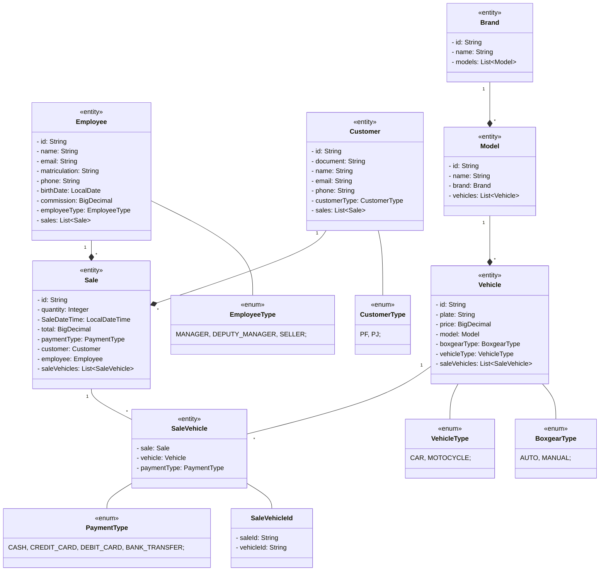

# Automendes

# Models

```mermaid
classDiagram

Employee -- EmployeeType
Customer -- CustomerType
Vehicle -- BoxgearType
Vehicle -- VehicleType
SaleVehicle -- SaleVehicleId
SaleVehicle -- PaymentType

Employee "1" --* "*" Sale
Customer "1" --* "*" Sale
Sale "1" -- "*" SaleVehicle
Vehicle "1" -- "*" SaleVehicle
Model "1" --* "*" Vehicle
Brand "1" --* "*" Model

class Customer {
    <<entity>>
    - id: String
    - document: String
    - name: String
    - email: String
    - phone: String 
    - customerType: CustomerType
    - sales: List~Sale~
}

class Employee {
    <<entity>>
    - id: String
    - name: String
    - email: String
    - matriculation: String
    - phone: String
    - birthDate: LocalDate
    - commission: BigDecimal
    - employeeType: EmployeeType
    - sales: List~Sale~
}

class Sale {
    <<entity>>
    - id: String
    - quantity: Integer
    - SaleDateTime: LocalDateTime
    - total: BigDecimal
    - paymentType: PaymentType
    - customer: Customer
    - employee: Employee
    - saleVehicles: List~SaleVehicle~ 
}

class SaleVehicle {
    <<entity>>
    - sale: Sale
    - vehicle: Vehicle
    - paymentType: PaymentType  
}

class SaleVehicleId {
    - saleId: String
    - vehicleId: String
}


class Vehicle {
    <<entity>>
    - id: String
    - plate: String
    - price: BigDecimal
    - model: Model
    - boxgearType: BoxgearType
    - vehicleType: VehicleType
    - saleVehicles: List~SaleVehicle~ 
}

class Model {
    <<entity>>
    - id: String
    - name: String
    - brand: Brand
    - vehicles: List~Vehicle~
}

class Brand {
    <<entity>>
    - id: String
    - name: String
    - models: List~Model~  
}

class PaymentType {
    <<enum>>
    CASH, CREDIT_CARD, DEBIT_CARD, BANK_TRANSFER;
}

class BoxgearType {
     <<enum>>
    AUTO, MANUAL;
}

class EmployeeType {
    <<enum>>
    MANAGER, DEPUTY_MANAGER, SELLER;
}

class CustomerType {
    <<enum>>
    PF, PJ;
}

class VehicleType {
    <<enum>>
    CAR, MOTOCYCLE;
}
```

# Backend

## technologies

- Java
- Spring Boot
- Hibernate/JPA
- Lombok
- PostgreeSQL
- H2
- MVC
- SOLID
- API Rest

# Frontend
