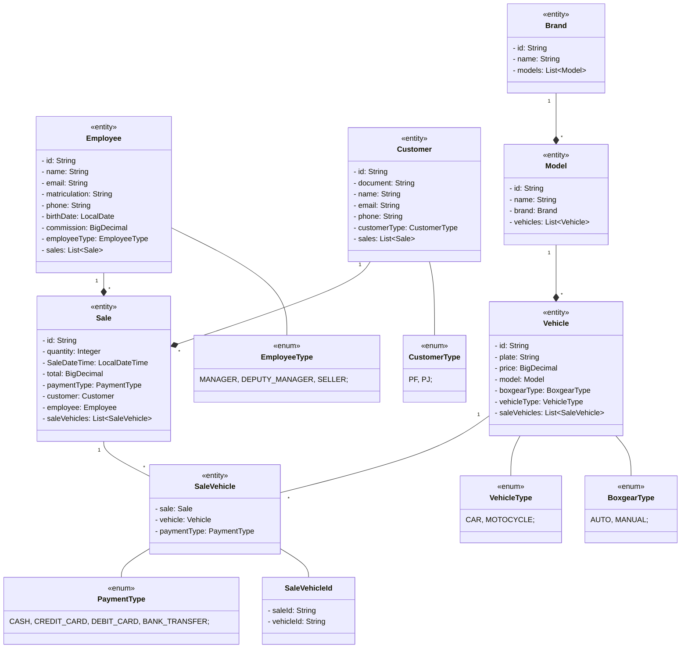

# Automendes

[](https://github.com/abnerjosefelixbarbosa/automendes/actions/workflows/build-backend.yml)

# Models

## About

Automendes backend application.

## Class Diagram



# Project Resources

## Features

- Register Brand
- Update Brand by Id
- List Brands
- Register Model
- Update Model By Id
- List Models
- Register Vehicle
- Update Vehicle By Id
- List Vehicles
- Register Employee
- Update Employee By Id
- List Employees
- Register Customer
- Update Customer By Id
- Search Customer By Document

## Backend

- Java
- Spring Boot
- Hibernate/JPA
- Lombok
- PostgreeSQL
- H2
- MVC
- SOLID
- API Rest

# Project Execution

- Clone and run in an IDE

```bash
# clonar repositório
git clone https://github.com/abnerjosefelixbarbosa/automendes.git
```

# Author

Abner José Felix Barbosa

[](https://www.linkedin.com/in/abner-jose-feliz-barbosa/)
