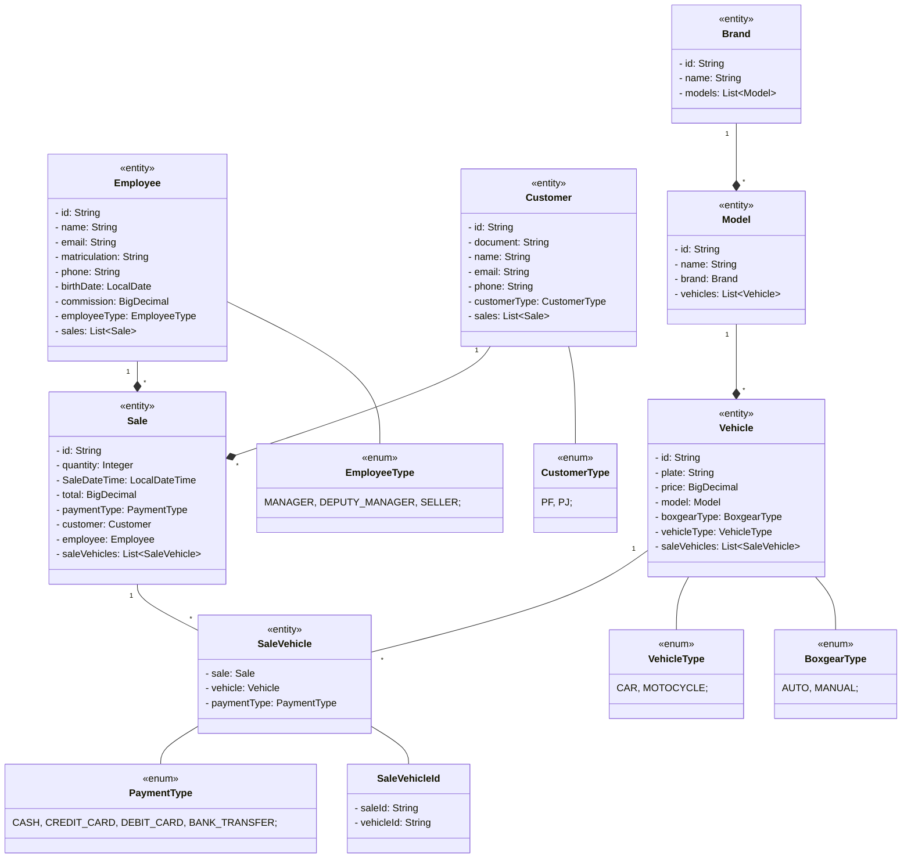

# Automendes

[](https://github.com/abnerjosefelixbarbosa/automendes/actions/workflows/build-backend.yml)

# Models



# Backend

## technologies

- Java
- Spring Boot
- Hibernate/JPA
- Lombok
- PostgreeSQL
- H2
- MVC
- SOLID
- API Rest

# Frontend

# Requests

## Brand

Register Brand

```json
/brands/register-brand

{
  "name": ""
}
```

Update Brand by Id

```json
/brands/update-brand-by-id?id=1

{
  "name": ""
}
```

List Brands

```json
/brands/list-brands
```

## Vehicle

Register Vehicle

```json
/vehicles/register-vehicle

{
  "plate": "",
  "modelName": "",
  "price": 0,
  "boxgearType": "AUTO",
  "vehicleType": "CAR"
}
```

Update Vehicle By Id

```json
/vehicles/update-vehicle-by-id?id=1

{
  "plate": "",
  "modelName": "",
  "price": 0,
  "boxgearType": "AUTO",
  "vehicleType": "CAR"
}
```

List Vehicles

```json
/vehicles/list-vehicles
```

## Model

Register Model

```json
/models/register-model

{
  "name": "",
  "brandName": ""
}
```

Update Model By Id

```json
/models/update-model-by-id?id=1

{
  "name": "",
  "brandName": ""
}
```

List Models

```json
/models/list-models

{
  "name": "string",
  "brandName": "string"
}
```

## Employee

Register Enployee

```json
/employees/register-employee

{
  "name": "",
  "email": "",
  "matriculation": "",
  "phone": "",
  "birthDate": "2025-10-22",
  "commission": 0,
  "employeeType": "MANAGER"
}
```

Update Employee By Id

```json
/employees/update-employee-by-id?id=1

{
  "name": "",
  "email": "",
  "matriculation": "",
  "phone": "",
  "birthDate": "2025-10-22",
  "commission": 0,
  "employeeType": "MANAGER"
}
```

List Models

```json
/models/list-models
```

## Customer

Register Customer

```json
/customers/register-customer

{
  "name": "",
  "email": "",
  "matriculation": "",
  "phone": "",
  "birthDate": "2025-10-22",
  "commission": 0,
  "employeeType": "MANAGER"
}
```

Update Customer By Id

```json
/customers/update-customer-by-id?id=1

{
  "name": "",
  "email": "",
  "matriculation": "",
  "phone": "",
  "birthDate": "2025-10-22",
  "commission": 0,
  "employeeType": "MANAGER"
}
```

Search Customer By Document

```json
/customers/search-customer-by-document?document=1
```
